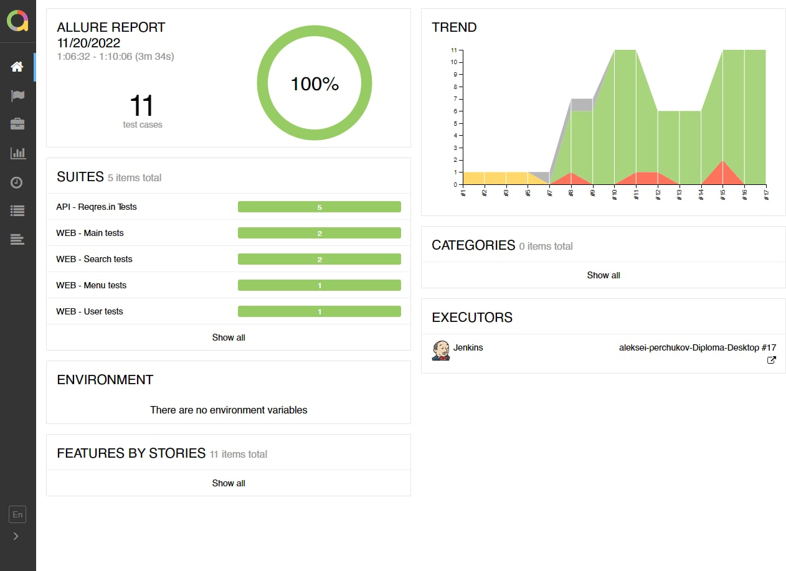
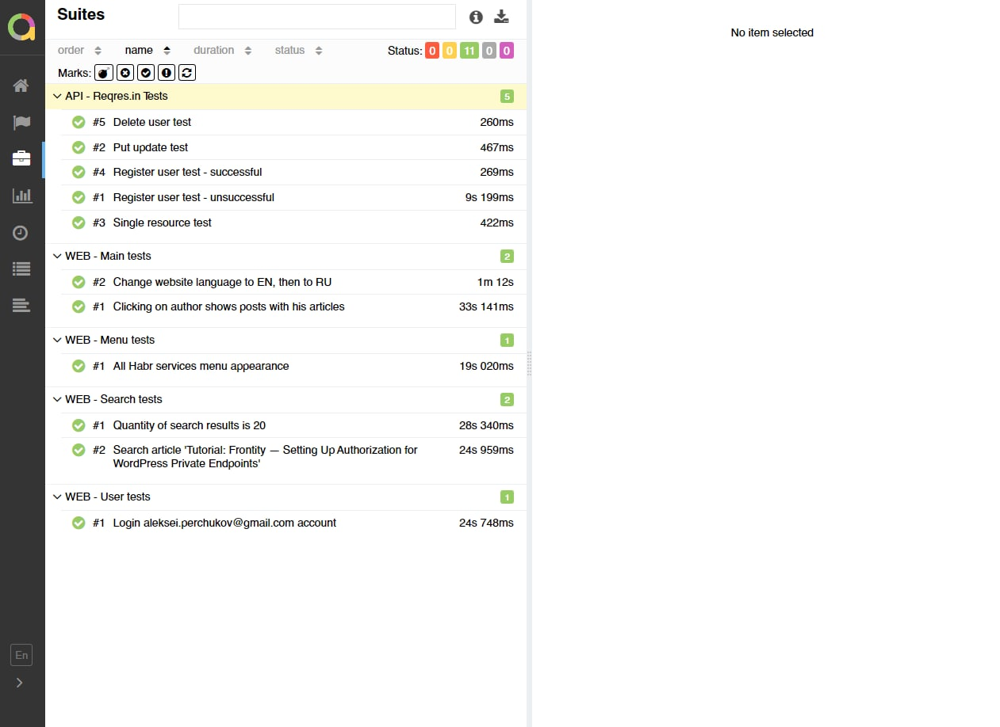
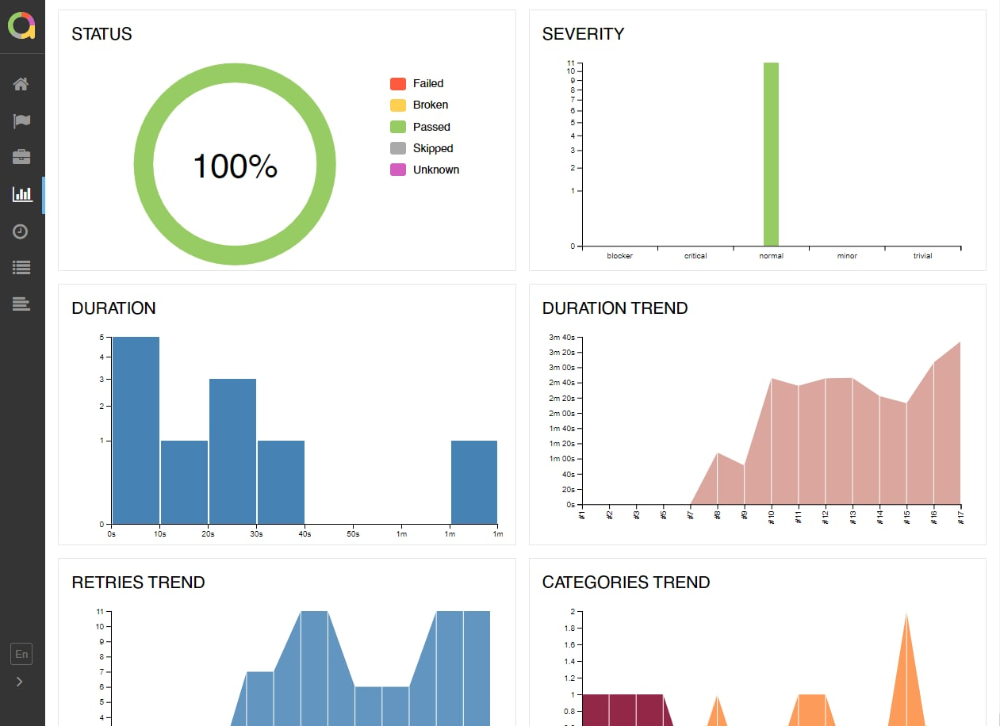
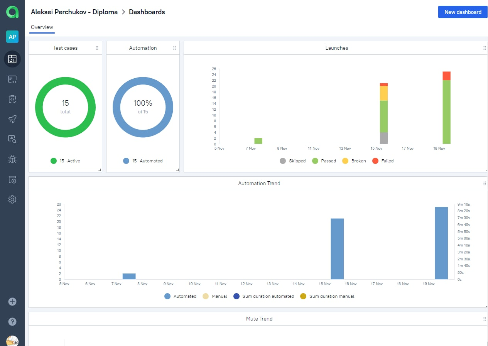
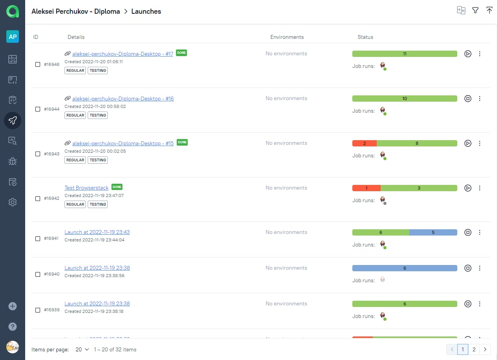

# Test automation project for <a target="_blank" href="https://habr.com/">Habr</a> & <a target="_blank" href="https://reqres.in/">Reqres.in</a>

## Contents:
- [Technologies and instruments](#gear)
- [Description](#description)
- [What we check](#check_mark)
- [Launch from Jenkins](#jenkins)
- [Launch from terminal](#terminal)
- [Reports](#reports)
- - [Allure](#allure)
- - [Telegram notifications](#telegram)
- [Test execution video](#test_video)
- [Allure TestOps](#testops)

## <b id="gear">Technology stack:</b>

<p align="center">


</p>

## <b id="description">Description</b>
In project were implemented the WEB, API and mobile tests of a small part of the functionality of Habr.com and Reqres.in websites. The PageObject autotest design pattern is used.

## <b id="check_mark">Что проверяем:</b>
- API-tests <a href=reqres.in>Reqres.in</a>
- WEB-tests <a href=habr.com>Habr.com</a>
- Android mobile app of <a href=habr.com>Habr.com</a> - HABAR (Unofficial)

##  Launching tests from Jenkins (<a href=https://jenkins.autotests.cloud/job/aleksei-perchukov-Diploma-Browserstack/>Browserstack</a>  & <a href=https://jenkins.autotests.cloud/job/aleksei-perchukov-Diploma-Desktop/>WEB+API</a>): 

<p><b id="jenkins">For launching from Jenkins:</b>
<br>Click "Собрать сейчас" button.
<br>


## <b id="terminal">For launching from terminal</b>

For local launching of WEB & API tests execute command:
```
gradle clean web_api_test -Dos=desktop-local
```

For local launching of  WEB & API тестов via selenoid execute command:
```
gradle clean web_api_test -Dos=desktop-remote
```

For local launching of mobile tests via Browserstack execute command:
```
gradle clean mobile_test -Dos=mobile-browserstack
```

For local launching of mobile tests via Android Studio emulator execute command:
```
gradle clean mobile_test -Dos=mobile-local
```

For local launching of mobile tests on real device execute command:
```
gradle clean mobile_test -Dos=mobile-real
```

## <b id="reports">Test reports available in Allure</b>

### <b id="allure"> Allure</b>

#### Main page



#### Graphics



#### Tests



###  Telegram

Configured sending a report by a bot to Telegram


## <b id="test_video">Test execution video</b>

В отчетах Allure для каждого теста прикреплен не только скриншот, но и видео прохождения теста
Allure reports have not only a screenshot, but also a video of passing each test attached

<p align="center">
  
</p>

## <b id="testops">Project is integrated with Allure TestOps</b>
 

#### Test-cases


#### Analytics dashboards



#### Launchs



