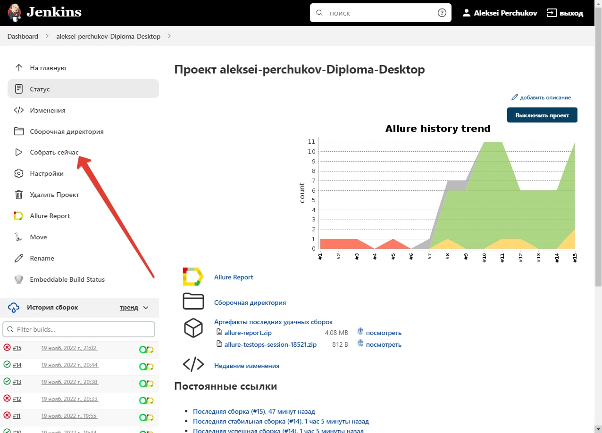
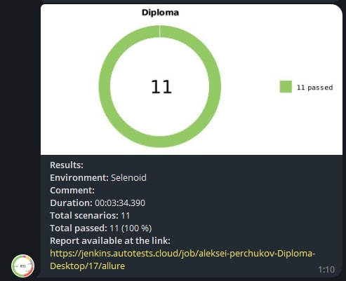
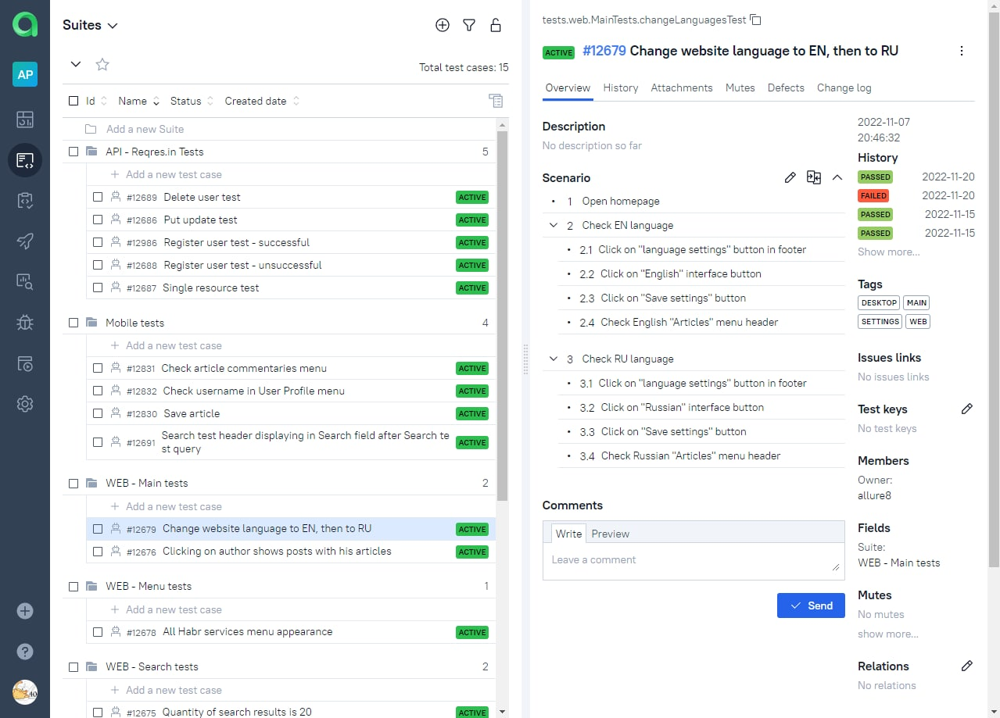

# Проект автоматизации тестирования для <a target="_blank" href="https://habr.com/">Habr</a> и <a target="_blank" href="https://reqres.in/">Reqres.in</a>

## Содержание:
- [Технологии и инструменты](#gear-в-проекте-используются-следующие-технологии-и-инструменты)
- [Что проверяем](#heavy_check_mark-что-проверяем)
- [Запуск тестов из Jenkins](#-запуск-тестов-из-jenkins)
- [Запуск тестов из терминала](#computer-запуск-тестов-из-терминала)
- [Отчеты](#bar_chart-отчеты-о-прохождении-тестов-доступны-в-allure)
- - [Allure](#-allure)
- - [Telegram](#-telegram)
- [Видео с прогоном тестов](#movie_camera-видео-с-прогоном-тестов)
- [Allure TestOps](#-проект-интегрирован-с-allure-testOps)

## В проекте используются следующие технологии и инструменты:

<p align="center">


</p>

## Описание
В проекте реализованы UI, API и Mobile тесты, небольшой части функционала и приложения сайта Habr.com и сайта Reqres.in для демонстрации возможностей проекта автоматизации. Использован паттерн проектирования автотестов PageObject.

## Что проверяем

> - Регистрацию нового пользователя;
> - Поиск курса;
> - Запись на курс;

##  Запуск тестов из Jenkins (<h3><a href=https://jenkins.autotests.cloud/job/aleksei-perchukov-Diploma-Browserstack/>Browserstack</a></h3>  & <h3><a href=https://jenkins.autotests.cloud/job/aleksei-perchukov-Diploma-Desktop/>WEB+API</a></h3>): 

<p>Для запуска тестов из Jenkins:
<br>Необходимо нажать кнопку "Собрать сейчас".
<br>


## Запуск тестов из терминала

Для локального запуска WEB & API тестов необходимо выполнить команду:
```
gradle clean web_api_test -Dos=desktop-local
```

Для локального запуска WEB & API тестов через selenoid необходимо выполнить команду:
```
gradle clean web_api_test -Dos=desktop-remote
```

Для локального запуска мобильных тестов в Browserstack необходимо выполнить команду:
```
gradle clean mobile_test -Dos=mobile-browserstack
```

Для локального запуска мобильных тестов на эмуляторе необходимо выполнить команду:
```
gradle clean mobile_test -Dos=mobile-local
```

Для локального запуска мобильных тестов на реальном девайсе необходимо выполнить команду:
```
gradle clean mobile_test -Dos=mobile-real
```

## Отчеты о прохождении тестов доступны в Allure

###  Allure

#### Главная страница


#### Графики


#### Тесты


###  Telegram

Настроена отправка отчета ботом в Telegram



## Видео с прогоном тестов

В отчетах Allure для каждого теста прикреплен не только скриншот, но и видео прохождения теста

<p align="center">
  
</p>

## Проект интегрирован с Allure TestOps
 

#### Представлены тест-кейсы



#### Представлены дашборды аналитики


#### Представлены запуски


